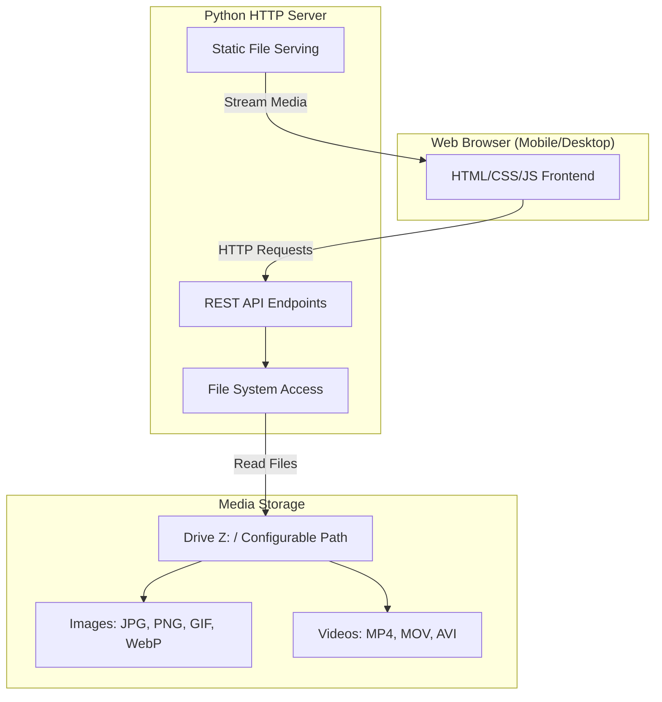

# Kilo HTTP Media Server - Architecture Plan

## 1. Overview

A lightweight Python-based HTTP media server that serves images and videos from a configurable directory (e.g., Drive Z:) with a mobile-friendly web interface for browsing and slideshow viewing.

## 2. System Architecture

## 3. Technology Stack

| Component | Technology | Justification |
|-----------|------------|---------------|
| Backend Framework | FastAPI | Modern, fast, async support, automatic OpenAPI docs |
| Server | Uvicorn | ASGI server, production-ready |
| File Handling | aiofiles | Async file operations |
| Frontend | Vanilla JS + CSS | Lightweight, no build step, mobile-friendly |
| Video Player | HTML5 Video | Native browser support |
| Image Viewer | Native img tag | Lightweight, mobile-optimized |

## 4. API Endpoints

| Method | Endpoint | Description |
|--------|----------|-------------|
| GET | `/api/directories` | List subdirectories in media root |
| GET | `/api/directories/{path}` | List subdirectories in specific path |
| GET | `/api/media/{path}` | List media files in directory |
| GET | `/media/{full_path}` | Stream media file (images/videos) |
| GET | `/` | Main page with directory browser |
| GET | `/slideshow/images` | Image slideshow page |
| GET | `/slideshow/videos` | Video slideshow page |

## 5. Key Features

### 5.1 Directory Browser
- Display folder tree starting from configured media root
- Click to navigate into subdirectories
- Breadcrumb navigation for easy backtracking
- Show media count per directory

### 5.2 Image Slideshow
- Full-screen image display
- Swipe navigation (mobile touch support)
- Auto-advance option with configurable interval
- Randomization toggle
- Previous/Next buttons (large, touch-friendly)
- Keyboard navigation (arrow keys)
- Progress indicator (current/total)
- Image preloading for smooth transitions
- Tap to show/hide controls

### 5.3 Video Slideshow
- Full-screen video player
- Auto-advance to next video when current ends
- Randomization toggle
- Previous/Next buttons (large, touch-friendly)
- Play/Pause toggle
- Progress bar with seek capability
- Keyboard navigation (arrow keys, space)
- Progress indicator (current/total)
- Tap to show/hide controls

### 5.4 Mobile Optimization
- Touch-friendly UI (large buttons, swipe gestures)
- Responsive layout
- Progressive loading (show thumbnails first)
- Minimal bandwidth usage

## 6. Configuration

| Option | Environment Variable | CLI Argument | Default | Description |
|--------|---------------------|---------------|---------|-------------|
| Media Root | `MEDIA_ROOT` | `--media-root` | Required | Path to media directory |
| Host | `HOST` | `--host` | `0.0.0.0` | Server bind address |
| Port | `PORT` | `--port` | `8000` | Server port |
| Images Extension | `IMG_EXTS` | `jpg,jpeg,png,gif,webp` | Supported image formats |
| Video Extensions | `VID_EXTS` | `mp4,mov,avi` | Supported video formats |

## 7. Acceptance Criteria

1. Server starts with configurable MEDIA_ROOT path
2. Directories are browsable from the root
3. Images display in slideshow with next/prev navigation
4. Videos play in slideshow with auto-advance
5. Randomization works for both media types
6. Mobile-friendly touch controls (swipe, large buttons)
7. Separate URLs for image and video slideshows
8. Accessible from network devices (0.0.0.0)
